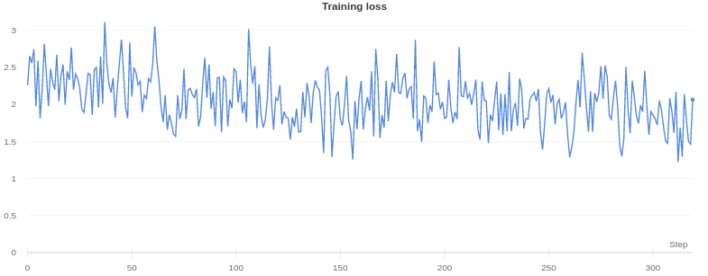
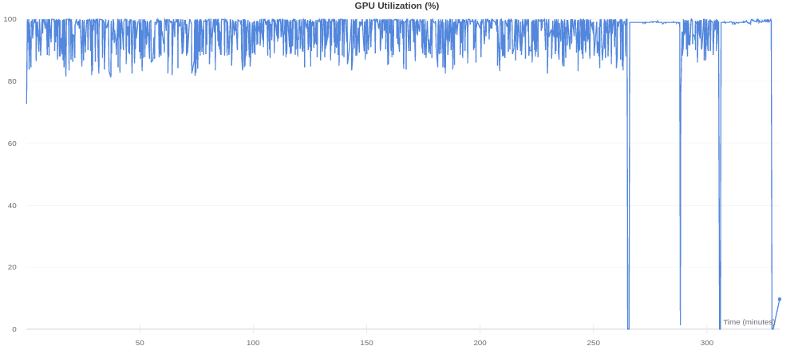
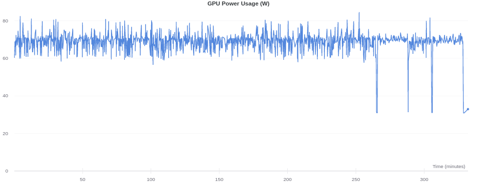
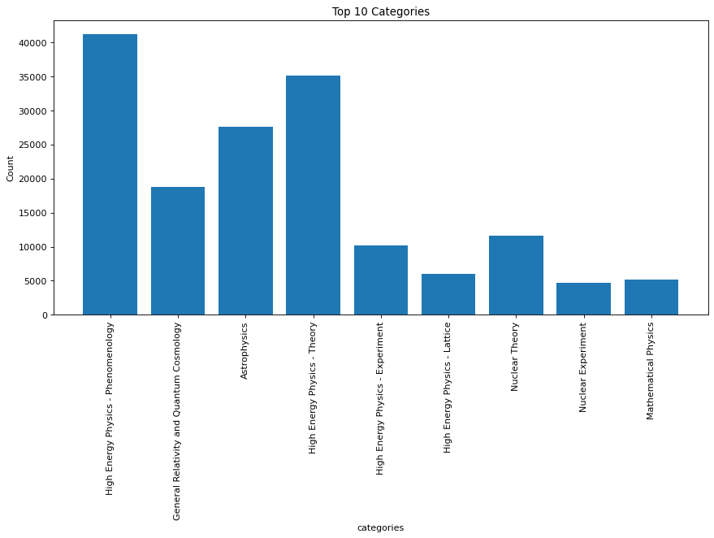
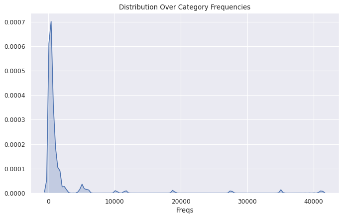
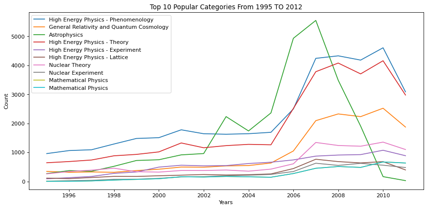
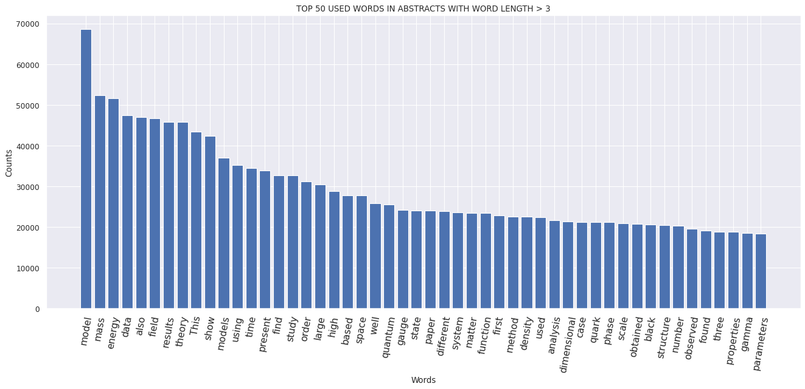
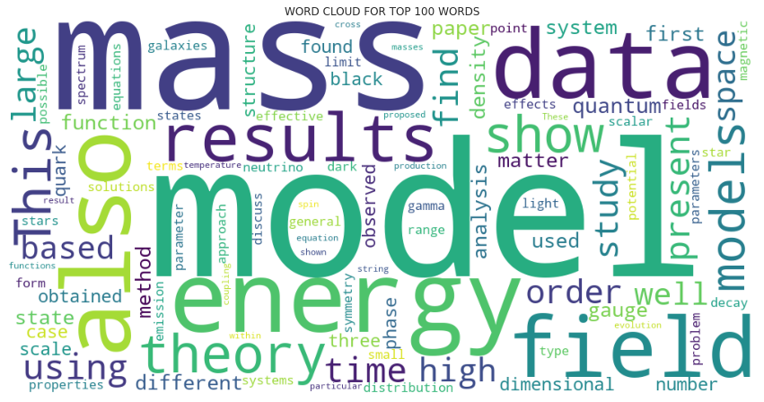

# Academic Paper Title Recommendation

Recommended repository names based on README:

    [['Using Language-Based Summarization Methods',
      'A New Method for Language Modeling',
      'The Supervised Summarization Model']]

Sequence to sequence Natural Processing Language tasks are progressing rapidly. They can used for Language Modeling, Machine Translation, Question Answering, and **Summarization**.

In this project, our aim is to create a supervised summarization model that generates titles from academic papers (their abstracts). Paper titles are exiciting section of papers, some of them relevent with paper content, some of them are not (e.g Attention Is All You Need). Titles motivate people to read the papers, have a big role on accepted submission to conferences. Maybe it can help people write more creative titles.

We have trained 2 models (yet).

- Seq2Seq LSTM (baseline)
- T5 Base (best results)

## About The Data

We use arXiv as a source for paper [dataset](https://www.kaggle.com/Cornell-University/arxiv). arXiv is a open pre-print and e-print website for papers and free.

This dataset is in .json format, we provided scripts for parsing data. Also tokenization and other preprocessing scripts are provided, they are explained in tutorial section.

The cleaned, parsed and tokenized version of data is provided in ./data folder as compressed.

A sample example from json data:

    Title: Sparsity-certifying Graph Decompositions 

    Abstract:   We describe a new algorithm, the $(k,\ell)$-pebble game with colors, and use
    it obtain a characterization of the family of $(k,\ell)$-sparse graphs and
    algorithmic solutions to a family of problems concerning tree decompositions of
    graphs. Special instances of sparse graphs appear in rigidity theory and have
    received increased attention in recent years. In particular, our colored
    pebbles generalize and strengthen the previous results of Lee and Streinu and
    give a new proof of the Tutte-Nash-Williams characterization of arboricity. We
    also present a new decomposition that certifies sparsity based on the
    $(k,\ell)$-pebble game with colors. Our work also exposes connections between
    pebble game algorithms and previous sparse graph algorithms by Gabow, Gabow and
    Westermann and Hendrickson.

    Ref: None 
    Categories: 
    Authors: math.CO cs.CG
    Authors Parsed: Ileana Streinu and Louis Theran


# Tutorial

## Data preparation from scratch

Dowload the [arXiv dataset from Kaggle](https://www.kaggle.com/Cornell-University/arxiv).

Save this in arbitrary path. Then run

```bash
python3 prep_data.py --datapath /path/to/your_json_file.json
```

This script parses your .json file then converts into .csv file, after that it does NLP techniques for abstracts.
After this script, you will have ./data/df_to_model.csv file. You can use it for training from scratch. 

## Seq2Seq LSTM
Seq2Seq LSTM is written with Keras. The summary of model looks like:

    Layer (type)                    Output Shape         Param #     Connected to                     
    ==================================================================================================
    encoder_inputs (InputLayer)     [(None, None)]       0                                            
    __________________________________________________________________________________________________
    encoder_embedding (Embedding)   (None, None, 100)    500200      encoder_inputs[0][0]             
    __________________________________________________________________________________________________
    decoder_inputs (InputLayer)     [(None, None, 2001)] 0                                            
    __________________________________________________________________________________________________
    encoder_lstm (LSTM)             [(None, 100), (None, 80400       encoder_embedding[0][0]          
    __________________________________________________________________________________________________
    decoder_lstm (LSTM)             [(None, None, 100),  840800      decoder_inputs[0][0]             
                                                                     encoder_lstm[0][1]               
                                                                     encoder_lstm[0][2]               
    __________________________________________________________________________________________________
    decoder_dense (Dense)           (None, None, 2001)   202101      decoder_lstm[0][0]               
    ==================================================================================================
    Total params: 1,623,501
    Trainable params: 1,623,501
    Non-trainable params: 0
    __________________________________________________________________________________________________

Additional: Also you can choose your Seq2Seq LSTM summarizer with global vectors for word representation (GloVe).

The Seq2Seq LSTM model can learn wording of academic titles and capture the main topic of the paper, but it cannot specify the title. Results are not sufficient.

### Training from scratch

First extract the .csv file from ./data/df_to_model.tar.gz to ./data folder (or create it from stracth).

Then run the training scripts

```bash
python3 train_lstm.py
```

### Generate titles from checkpoints

./models folder contains checkpoints for specific epochs. Move your .json, .npy and .h5 file into ./modes (default = epoch 100). Then run

```bash
python3 generate_lstm.py --abstract /path/to/your_abstract_file.txt
```

Then the generated title will be saved in ./docs/titles folder.


## T5

We trained T5-Base (which has ~220M parameters with 12-layers, 768-hidden-state, 3072 feed-forward hidden-state, 12-heads) on arXiv paper dataset from scratch, using [🤗 Huggingface/transformers](https://github.com/huggingface/transformers) and [Simpletransformers](https://github.com/ThilinaRajapakse/simpletransformers).

The T5 model was presented in [Exploring the Limits of Transfer Learning with a Unified Text-to-Text Transformer](https://arxiv.org/pdf/1910.10683.pdf) by Colin Raffel, Noam Shazeer, Adam Roberts, Katherine Lee, Sharan Narang, Michael Matena, Yanqi Zhou, Wei Li, Peter J. Liu.

T5 is an encoder-decoder model pre-trained on a multi-task mixture of unsupervised and supervised tasks and for which each task is converted into a text-to-text format. T5 works well on a variety of tasks out-of-the-box by prepending a different prefix to the input corresponding to each task, e.g., for translation: translate English to German, ... for summarization: summarize...

T5 is an encoder-decoder model and converts all NLP problems into a text-to-text format. It is trained using teacher forcing. This means that for training we always need an input sequence and a target sequence.

The prefix can be easily added to csv_to_model file like

```python
train_df['prefix'] = "summarize"
eval_df['prefix'] = "summarize"
```
Training and generating script for T5 also provided in ./T5 director.

### Performance
We trained T5 Base model on Colab's Tesla K80, with 11 GB of GPU RAM for 8 hours. 

- Training Loss


- GPU Utilization


- GPU Power Usage


Best results are from T5. It can learn wordings well, and it also can learn the topic detailed (also it can show what is new in the paper with recommended title). Even though the dataset mainly contains Physics papers, it can learn the context, wording, what's novel in paper etc in various sub-field of science. 

### Some Examples

- [Adam: A Method for Stochastic Optimization (Kingma et al., 2014)](https://arxiv.org/abs/1412.6980)

        [['A Stochastic Optimization Theory Method for Non-stationary Strategies',
          'A Probabilistic Algorithm for Stochastic Optimization using Adaptive Moments',
          'Algorithm for gradient-based optimization of stochastic functions']]
          
- [Language Models are Few-Shot Learners (Brown et al., 2020)](https://arxiv.org/abs/1412.6980)

        [['Train-off: scaling up language models for precision data sets',
          'GPT-3: A Comparable Evaluation of Task and Benchmarking',
          'Testing performance of fine-tuning languages']]

Also it can recommend very useful titles for you papers. For example based on our paper called "Data Communication Protocols In Wireless Sensor
Networks", based on this abstract:

        This paper describes the concept of sensor networks which has been made viable by the convergence of micro-
        electro-mechanical systems technology, wireless communications and digital electronics. First, the sensing tasks and the
        potential sensor networks applications are explored, and a review of factors influencing the design of sensor networks is
        provided. Then, the communication architecture for sensor networks is outlined, and the algorithms and protocols
        developed for each layer in the literature are explored. Open research issues for the realization of sensor networks are
        also discussed.

this titles are recommended/generated:

        ['Sensor networks: The novel concepts and perspectives',
         'Sensor Networks: Convergence and Applications',
         'The Applied Field Theory Theory of Sensor Networks for e+ e- to Sensing Networks']]
         
You can find other examples in ./T5 directory (in the README.md).

### Checkpoints

The checkpoints of our model is provided in the [drive link](https://drive.google.com/drive/folders/1MJnqmXqXBNdb9UvchQ72oMFO4HBXC_mn?usp=sharing). Create a shortcut of this shared file then run the script

```python
from simpletransformers.t5 import T5Model
model_args = {
    "reprocess_input_data": True,
    "overwrite_output_dir": True,
    "max_seq_length": 256,
    "eval_batch_size": 128,
    "num_train_epochs": 1,
    "save_eval_checkpoints": False,
    "use_multiprocessing": False,
    "num_beams": None,
    "do_sample": True,
    "max_length": 50,
    "top_k": 50,
    "top_p": 0.95,
    "num_return_sequences": 3,
}

model = T5Model("t5","/content/drive/My Drive/outputs/checkpoint-15982-epoch-1", args=model_args)
```

The prediction comes with:
```python
abss =["summarize: "+"""We trained a large, deep convolutional neural network to classify the 1.3 million high-resolution images in the LSVRC-2010 ImageNet training set into the 1000 different classes. 
On the test data, we achieved top-1 and top-5 error rates of 39.7% and 18.9% which is considerably better than the previous state-of-the-art results. 
The neural network, which has 60 million parameters and 500,000 neurons, consists of five convolutional layers, some of which are followed by max-pooling layers, 
and two globally connected layers with a final 1000-way softmax. To make training faster, we used non-saturating neurons and a very efficient GPU implementation of convolutional nets. 
To reduce overfitting in the globally connected layers we employed a new regularization method that proved to be very effective."""]
predicted_title = model.predict(abss)
predicted_title
```

## Data Analysis

We also provided exploratory data analysis scripts for papers in the ./utils directory.

- Top 10 categories


- Distribution Over Category Frequenicies


- Top 10 Popular Categories From 1995 To 2012


- Top 50 Used Words In Abstracts With Word Length > 3


- Word Cloud For Top 100 Words


    TOP 10 AUTHOR BY PUBLICATON:
       B. Aubert: 260
       The BABAR Collaboration: 193
       CLEO Collaboration: 167
       ZEUS Collaboration: 154
       D0 Collaboration: 148
       John Ellis: 140
       Lorenzo Iorio: 138
       R. Horsley: 138
       Cambridge: 136
       CDF Collaboration: 122
       


