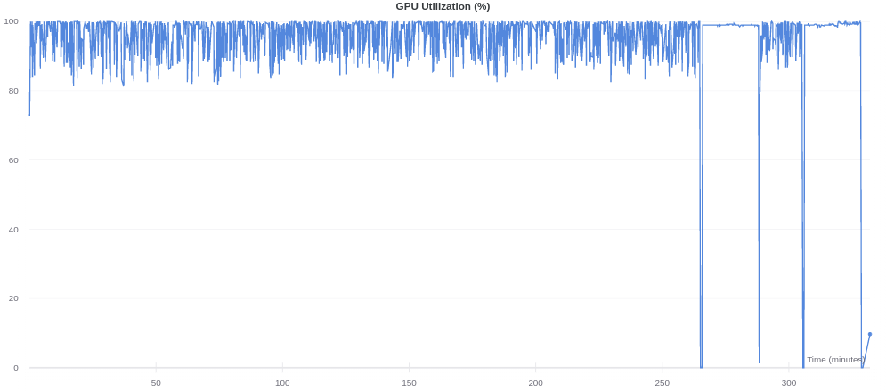
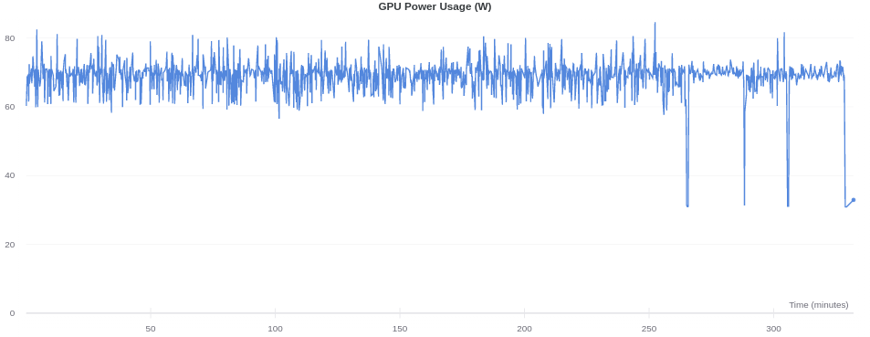
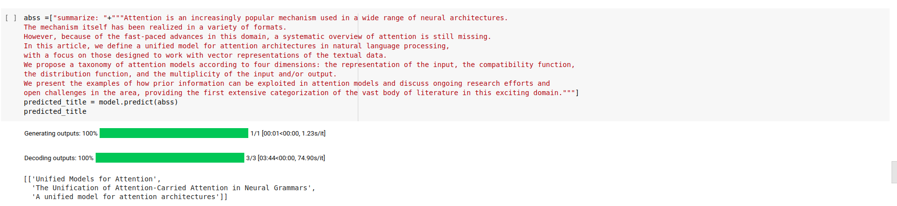

# Generating Titles With T5 Model

!!Colab is highly recommended!!

We trained T5-Base (which has ~220M parameters with 12-layers, 768-hidden-state, 3072 feed-forward hidden-state, 12-heads) on arXiv paper dataset from scratch, using [🤗 Huggingface/transformers](https://github.com/huggingface/transformers) and [Simpletransformers](https://github.com/ThilinaRajapakse/simpletransformers).

The T5 model was presented in [Exploring the Limits of Transfer Learning with a Unified Text-to-Text Transformer](https://arxiv.org/pdf/1910.10683.pdf) by Colin Raffel, Noam Shazeer, Adam Roberts, Katherine Lee, Sharan Narang, Michael Matena, Yanqi Zhou, Wei Li, Peter J. Liu.

T5 is an encoder-decoder model pre-trained on a multi-task mixture of unsupervised and supervised tasks and for which each task is converted into a text-to-text format. T5 works well on a variety of tasks out-of-the-box by prepending a different prefix to the input corresponding to each task, e.g., for translation: translate English to German, ... for summarization: summarize...

T5 is an encoder-decoder model and converts all NLP problems into a text-to-text format. It is trained using teacher forcing. This means that for training we always need an input sequence and a target sequence.

The prefix can be easily added to csv_to_model file like

```python
train_df['prefix'] = "summarize"
eval_df['prefix'] = "summarize"
```
Training and generating script for T5 also provided in ./T5 director.

### Performance
We trained T5 Base model on Colab's Tesla K80, with 11 GB of GPU RAM for 8 hours. 

- Training Loss


- GPU Utilization


- GPU Power Usage


Best results are from T5. It can learn wordings well, and it also can learn the topic detailed (also it can show what is new in the paper with recommended title). Even though the dataset mainly contains Physics papers, it can learn the context, wording, what's novel in paper etc in various sub-field of science. 

### Some Examples

- [Adam: A Method for Stochastic Optimization (Kingma et al., 2014)](https://arxiv.org/abs/1412.6980)

        [['A Stochastic Optimization Theory Method for Non-stationary Strategies',
          'A Probabilistic Algorithm for Stochastic Optimization using Adaptive Moments',
          'Algorithm for gradient-based optimization of stochastic functions']]
          
- [Language Models are Few-Shot Learners (Brown et al., 2020)](https://arxiv.org/abs/1412.6980)

        [['Train-off: scaling up language models for precision data sets',
          'GPT-3: A Comparable Evaluation of Task and Benchmarking',
          'Testing performance of fine-tuning languages']]

Also it can recommend very useful titles for you papers. For example based on our paper called "Data Communication Protocols In Wireless Sensor
Networks", based on this abstract:

        This paper describes the concept of sensor networks which has been made viable by the convergence of micro-
        electro-mechanical systems technology, wireless communications and digital electronics. First, the sensing tasks and the
        potential sensor networks applications are explored, and a review of factors influencing the design of sensor networks is
        provided. Then, the communication architecture for sensor networks is outlined, and the algorithms and protocols
        developed for each layer in the literature are explored. Open research issues for the realization of sensor networks are
        also discussed.

this titles are recommended/generated:

        ['Sensor networks: The novel concepts and perspectives',
         'Sensor Networks: Convergence and Applications',
         'The Applied Field Theory Theory of Sensor Networks for e+ e- to Sensing Networks']]
         
You can find other examples in ./T5 directory (in the README.md).

### Checkpoints

The checkpoints of our model is provided in the [drive link](https://drive.google.com/drive/folders/1MJnqmXqXBNdb9UvchQ72oMFO4HBXC_mn?usp=sharing). Create a shortcut of this shared file then run the script

```python
from simpletransformers.t5 import T5Model
model_args = {
    "reprocess_input_data": True,
    "overwrite_output_dir": True,
    "max_seq_length": 256,
    "eval_batch_size": 128,
    "num_train_epochs": 1,
    "save_eval_checkpoints": False,
    "use_multiprocessing": False,
    "num_beams": None,
    "do_sample": True,
    "max_length": 50,
    "top_k": 50,
    "top_p": 0.95,
    "num_return_sequences": 3,
}

model = T5Model("t5","/content/drive/My Drive/best_model", args=model_args)
```

The prediction comes with:
```python
abss =["summarize: "+"""We trained a large, deep convolutional neural network to classify the 1.3 million high-resolution images in the LSVRC-2010 ImageNet training set into the 1000 different classes. 
On the test data, we achieved top-1 and top-5 error rates of 39.7% and 18.9% which is considerably better than the previous state-of-the-art results. 
The neural network, which has 60 million parameters and 500,000 neurons, consists of five convolutional layers, some of which are followed by max-pooling layers, 
and two globally connected layers with a final 1000-way softmax. To make training faster, we used non-saturating neurons and a very efficient GPU implementation of convolutional nets. 
To reduce overfitting in the globally connected layers we employed a new regularization method that proved to be very effective."""]
predicted_title = model.predict(abss)
predicted_title
```





